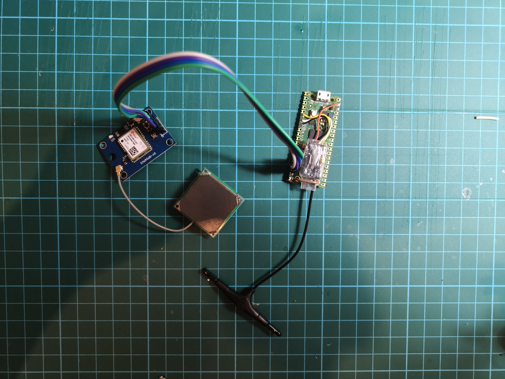

# Pioneer Experimental Flight Controller
Experimental flight controller for RP2040, written in pure C using the [Raspberry Pi Pico SDK](https://github.com/raspberrypi/pico-sdk).
> [!NOTE]
> This is a side project and is still a work in progress! Rate of progress will hence be variable.

## Current features
- Radio link using the ELRS protocol
- GPS functionality
- IMU functionality

## Hardware setup
The main development board used is the Raspberry Pi Pico W (first generation). Additional peripherals have been added to increase functionality and these include:
- ELRS receiver
- GY-NEO6MV2 GPS module
- MPU6050 IMU

Here's how the whole set up currently looks like:

## Why?
There are many excellent flight controllers out there, and I'm doing this mainly for fun, but also to practice my C skills.

The RP2040 was chosen because it was just what I had lying around.

## References
Here are some important references I used.
1. CRSF protocol specfications: https://github.com/tbs-fpv/tbs-crsf-spec/blob/main/crsf.md
2. GY-NEO6MV2 UART protocol specifications: https://content.u-blox.com/sites/default/files/products/documents/u-blox6_ReceiverDescrProtSpec_%28GPS.G6-SW-10018%29_Public.pdf
3. NEO-6 datasheet: https://content.u-blox.com/sites/default/files/products/documents/NEO-6_DataSheet_%28GPS.G6-HW-09005%29.pdf
4. RP2040 C SDK documentation: https://pip.raspberrypi.com/documents/RP-009085-KB-raspberry-pi-pico-c-sdk.pdf
5. More RP2040 C SDK documentation: https://www.raspberrypi.com/documentation/microcontrollers/c_sdk.html
6. MPU6050 driver: https://github.com/santtos0x1/mpu-6050-gyroscope-driver/
